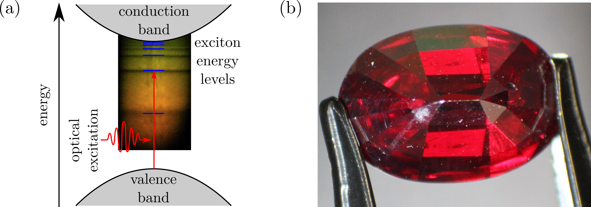
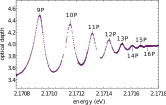

## Excitons
Excitons are atom-like particles which are found in bulk semiconductors. They are formed of an electron and a hole which are bound together in a Coulomb potential. As they are a bound state of a positive and negative charge, they are analogous to hydrogen atoms, and share a similar ladder of energy levels. 

These energy levels are observed as discrete states below the bandgap of the material as shown in Figure (a). In this project we study highly excited states of these excitons, known as Rydberg excitons. The coloured background in Figure (a) shows an exciton spectrum. Each of the dark lines corresponds to a different exciton absorption line. 

## Excitons in Cuprous Oxide
We use the direct bandgap semiconductor cuprous oxide (Cu2O). Cuprous oxide was the first material in which excitons were observed and remains the material which holds the record for the highest excited exciton states of any material. A red gemstone of cuprous oxide is shown in Figure (b). Most of the material we use comes from natural sources. However, high quality natural samples are rare, and so we are also exploring the growth of synthetic cuprous oxide (through collaborations in Cardiff and India). 

## Properties of Excitons
The high lying Rydberg excitons show many exaggerated properties compared to ground state excitons. Higher energy Rydberg states are less tightly bound, leading to excitons with large spatial extents. For the highest lying states observed so far, the radius of the exciton wavefunction can by on the order of micrometers, meaning there are billions of lattice sites within the exciton wavefunction! Due to their size, excitons have large dipole moments which leads to effects such as interactions between the excitons. 

## Probing Excitons
To observe high lying exciton states we need to cool our samples to low temperatures. For this, we use a liquid helium based cryostation which can cool our samples to 4 K.  Once cooled, we use a laser to excite our Rydberg excitons. As excitons obey similar selection rules to atoms, we can use one- or two-photon excitation schemes to reach exciton states with different angular momenta. Figure below shows two exciton spectra, one taken in a one-photon excitation scheme, and the other taken by two-photon (second harmonic generation) spectroscopy. In the one-photon plot we see exciton states with P symmetry, whereas in the two-photon plot the states with S and D symmetry dominate the spectrum.

## Microwav-to-optical Light Coupling
In our experiment we also apply microwave fields to our samples. The addition of the microwave field allows us to drive transitions between Rydberg exciton states of opposite parity. This gives us an additional degree of control over the Rydberg excitons, and we have recently demonstrated it allows us to coherently modulate an optical carrier. Figure below shows the effect of a microwave field on our exciton spectrum. The change in absorption due to the microwave field in a one-photon excitation scheme is shown. We see a decreased optical depth on resonance with the P states, and an increase in optical depth at the energy of the S and D states, indicating the excitons are driving transitions from the P states to the S and the D states.

## Future Plans 
In future, we plan to explore this microwave-exciton coupling further. One of our future directions is to place cuprous oxide on a microwave resonator. This would allow us to achieve much higher microwave field strengths, and let us reach a new regime for the microwave-exciton coupling. We also hope to observe microwave induced interactions between excitons. These interactions have been observed in atomic Rydberg systems, but not in the solid-state. One final direction for the project is to the look at the quantum statistics of the emitted light, opening up potential quantum optical applications for this fascinating material.

## Apply Now!!
If you are interested in joining the team or finding out more, please contact m.p.a.jones@durham.ac.uk.

## Team members 
PI:          [Prof. Matthew Jones](https://www.durham.ac.uk/staff/m-p-a-jones/)  
Postdoc:     [Dr. Liam Gallagher](https://www.durham.ac.uk/staff/liam-a-gallagher/)  
PhD student: [Qin Xi (Horatio) Wong](https://www.durham.ac.uk/staff/qin-x-wong/)  

## Publications
[1] Gallagher, L., Rogers, J., Pritchett, J., Mistry, R., Pizzey, D., Adams, C., Jones, M., Grünwald, P., Walther, V., & Hodges, C. (2022). Microwave-optical coupling via Rydberg excitons in cuprous oxide. Physical Review Research.  

[2] Rogers, J., Gallagher, L., Pizzey, D., Pritchett, J., Adams, C., Jones, M., Hodges, C., Langbein, W., & Lynch, S. (2022). High-resolution nanosecond spectroscopy of even-parity Rydberg excitons in Cu 2 O. Physical Review B.  

[3] Lynch, S., Hodges, C., Mandal, S., Langbein, W., Singh, R., Gallagher, L., Pritchett, J., Pizzey, D., Rogers, J., & Adams, C. (2021). Rydberg excitons in synthetic cuprous oxide Cu 2 O. Physical Review Materials.

## PhD Theses
[1] Gallagher, L. (2022). Optical and microwave spectroscopy of Rydberg excitons in Cu $ _2 $ O. Doctoral dissertation, Durham University.
